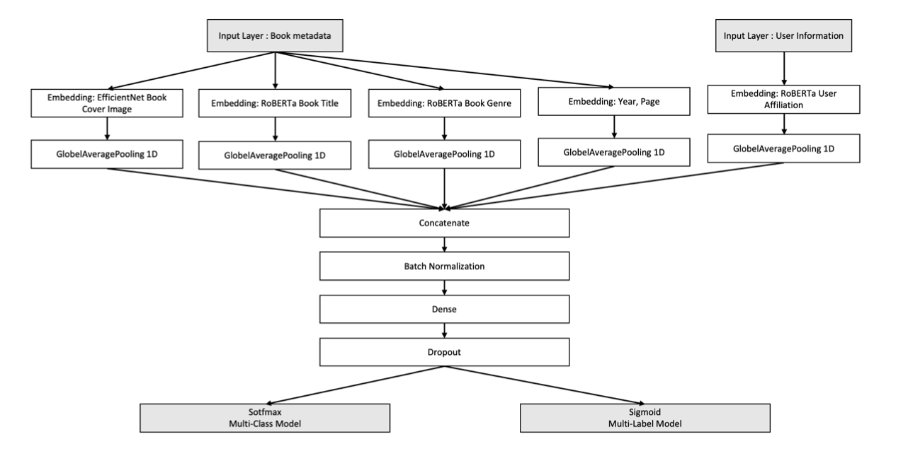

---

##### Download

+ [Paper](paper2.pdf)
+ [Code and data](https://github.com/chaeeun-h/CO-DEEP_Learning_2020_Fall)

---

##### Abstract

Recommendation systems have been widely used in various commercial applications for predicting the rating a user may give to an item. To encourage students to read more books, personalized book recommendation systems are of great interest in university libraries. Because university libraries do not ask students to rate books that they borrowed, book reviews and ratings are not available. Without book ratings, implementing personalized book recommendation systems in libraries is a challenging problem. In this study, we propose a library book recommendation system that uses embedding based neural network models. The system uses book metadata and user information as input features and deep learning models were used to create embeddings of the features. A multi-class classification model and a multi-label classification model were trained and soft voting was used to integrate the final outcomes. The performance of the models was evaluated by 72 university students and the multi-class classification model received 3.4 average points whereas the multi-label classification model scored 3.0 average points in the 5-Point Likert Scale.

---

##### Figure X: Figure caption



---

##### Citation

Choi, Jaeyoung, et al. "Embedding-based neural network models for book recommendation in university libraries." CEUR Workshop Proceedings. Vol. 2871. CEUR-WS, 2021.

```BibTeX
@inproceedings{choi2021embedding,
  title={Embedding-based neural network models for book recommendation in university libraries},
  author={Choi, Jaeyoung and Han, Chaeeun and Yang, Heeyoon and Hong, Yeonkyoung and Jeon, Seoyoung and Zhu, Yongjun},
  booktitle={CEUR Workshop Proceedings},
  volume={2871},
  pages={25--32},
  year={2021},
  organization={CEUR-WS}
}
```

---

##### Related material

+ [Presentation slides](presentation2.pdf)

