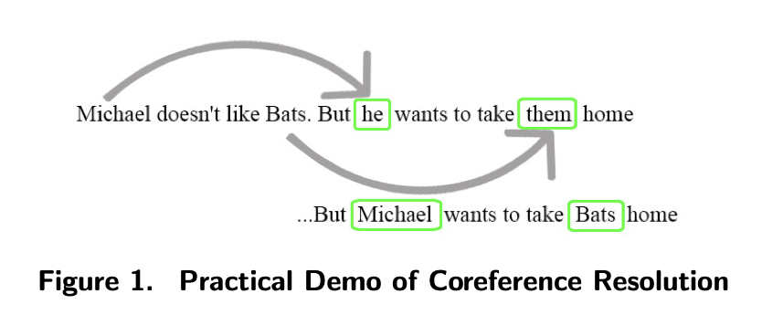

---

##### Download

+ [Paper](paper3.pdf)
+ [Code and data](https://hdl.handle.net/10125/106683)

---

##### Abstract

Despite the growing number of natural language processing (NLP) tools developed for decision-makers to leverage social media for public perception evaluation during crises, a more robust framework is needed. This study explores a domain-specific machine learning framework for perception analysis using tweets about bats during disease outbreaks as a case study. Zoonotic disease outbreaks such as COVID-19 and Ebola are often attributed to bats and have resulted in unnecessary culling of wildlife; therefore, this is a case where perception is meaningful to a species. Analysis of 15,968 tweets showed a pattern in which tweets with anti-bat perceptions were most common during the early phases of an outbreak but declined over time while remaining negative, with 87.6% reliability of the framework according to manual coding of 300 randomly selected tweets. The framework can help stakeholders understand trends in public perception in near real-time and guide responses to spreading misinformation.

---

##### Figure 1: Practical Demo of Coreference Resolution



---

##### Citation

Okpala, I., Romera Rodriguez, G., Han, C., Meierhofer, M., Mammola, S., Halse, S., ... & Johnson, J. (2024). A Framework for Perception Analysis of Social Media Data During Disease Outbreaks: Uncovering Patterns of Resentment Towards Bats.

```BibTeX
@article{okpala2024framework,
  title={A Framework for Perception Analysis of Social Media Data During Disease Outbreaks: Uncovering Patterns of Resentment Towards Bats},
  author={Okpala, Izunna and Romera Rodriguez, Guillermo and Han, Chaeeun and Meierhofer, Melissa and Mammola, Stefano and Halse, Shane and Kropczynski, Jess and Johnson, Joseph},
  year={2024}
}
```

---

##### Related material

+ [Presentation slides](presentation3.pdf)

