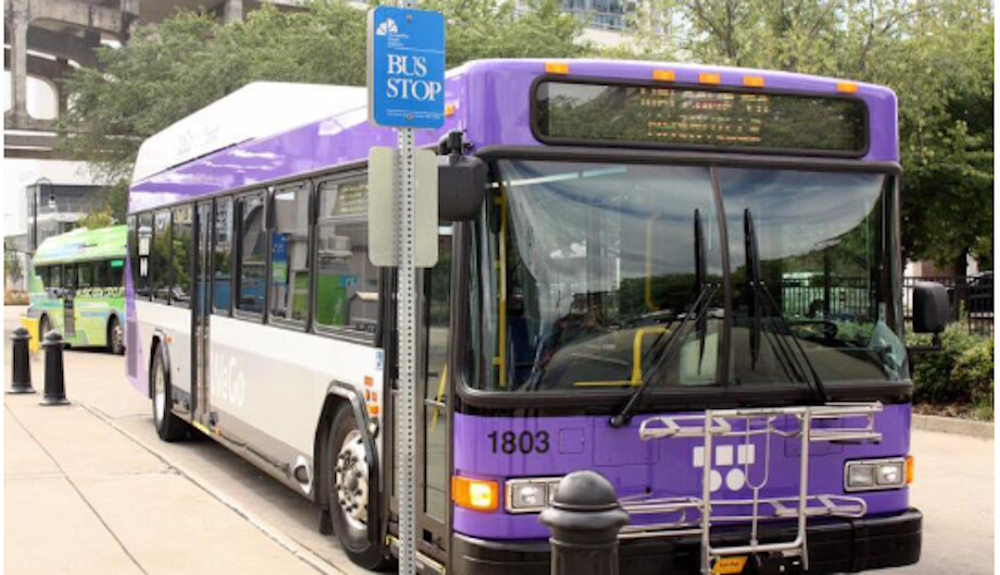

---

##### Download

+ [Paper](paper4.pdf)
+ [Code and data](https://github.com/chaeeun-h/bus-disruption-forecast)

---

##### Abstract

Public transportation systems often suffer from unexpected fluctuations in demand and disruptions, such as mechanical failures and medical emergencies. These fluctuations and disruptions lead to delays and overcrowding, which are detrimental to the passengers’ experience and to the overall performance of the transit service. To proactively mitigate such events, many transit agencies station substitute (reserve) vehicles throughout their service areas, which they can dispatch to augment or replace vehicles on routes that suffer overcrowding or disruption. However, determining the optimal locations where substitute vehicles should be stationed is a challenging problem due to the inherent randomness of disruptions and due to the combinatorial nature of selecting locations across a city. In collaboration with the transit agency of a mid-size U.S. city, we address this problem by introducing data-driven statistical and machine-learning models for forecasting disruptions and an effective randomized local-search algorithm for selecting locations where substitute vehicles are to be stationed. Our research demonstrates promising results in proactive disruption management, offering a practical and easily implementable solution for transit agencies to enhance the reliability of their services. Our results resonate beyond mere operational efficiency—by advancing proactive strategies, our approach fosters more resilient and accessible public transportation, contributing to equitable urban mobility and ultimately benefiting the communities that rely on public transportation the most.

---

##### Figure X: Figure caption



---

##### Citation

Han, C., Talusan, J.P., Mukhopadhyay, A., Freudberg, D., Dubey A., and Laszka, A. (2024). Forecasting and Mitigating Disruptions in Public Bus Transit Services, AAMAS 2024. 

```BibTeX
@article{choi2021embedding,
  title={Forecasting and Mitigating Disruptions in Public Bus Transit Services},
  author={Choi, Jaeyoung and Han, Chaeeun and Yang, Heeyoon and Hong, Yeonkyoung and Jeon, Seoyoung and Zhu, Yongjun},
  booktitle={CEUR Workshop Proceedings},
  volume={2871},
  pages={25--32},
  year={2021},
  organization={CEUR-WS}
}
```

---

##### Related material

+ [Poster Presentation](presentation4.pdf)

