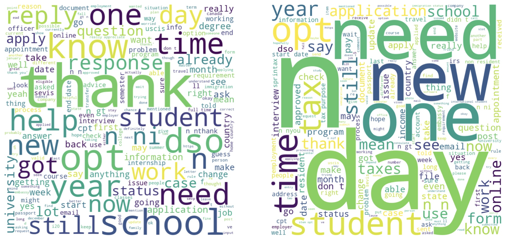

---

##### Download

+ [Paper](paper6.pdf)

---

##### Abstract

This study examines the impact of the COVID-19 pandemic on information-seeking behaviors among international students, focusing on the r/f1visa subreddit. Our study indicates a considerable rise in the number of users posting more than one question during the pandemic. Those asking recurring questions demonstrate more active involvement in communication, suggesting a continuous pursuit of knowledge. Furthermore, the thematic focus has shifted from questions about jobs before COVID-19 to concerns about finances, school preparations, and taxes during COVID-19. These findings carry implications for support policymaking, highlighting the importance of delivering timely and relevant information to meet the evolving needs of international students. To enhance international students' understanding and navigation of this dynamic environment, future research in this field is necessary.

---

##### Figure 3: Word Cloud of Comments: (a) It analyzed comments from posts created by users who only posted one post. (b) It analyzed comments from posts created by authors who posted more than five posts.



---

##### Citation

Youm, S, Han, C., Jang, SH. Information Seeking and Communication among International Students on Reddit.

```BibTeX
@inproceedings{inproceedings,
author = {Han, Chaeeun},
year = {2024},
month = {05},
pages = {},
title = {Information Seeking and Communication among International Students on Reddit}
}
```

---

##### Related material

+ [Poster Presentation](presentation6.pdf)

